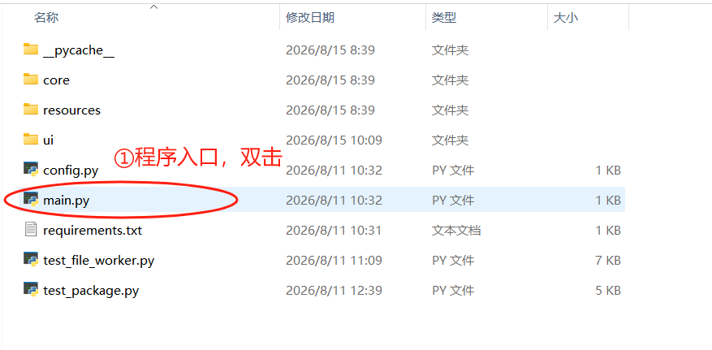
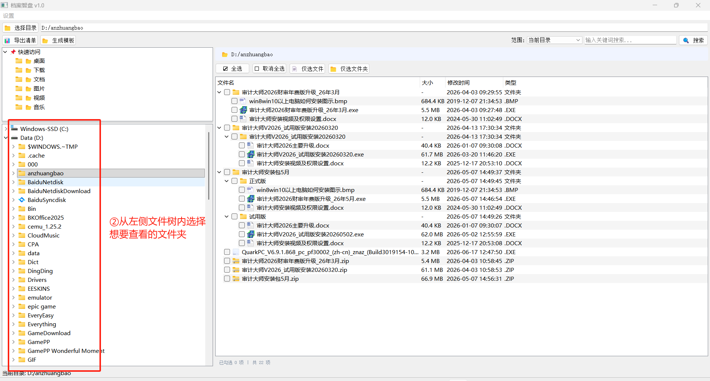

# 文件夹快速查阅浏览

选择计算机本地文件夹，可选择性导出或导出给文件夹下带有对应文件名称的超链接表格 。适用于文件夹浏览，文件归档检查的情景。

## 主要功能

- 遍历文件夹结构与文件，一键生成具有超链接的表格。
- 文件夹浏览、快速归档。

## 环境要求

- pip install .....

## 使用步骤

### 1. 打开程序，选择想要查看或导出的文件夹

①双击“main.py”程序入口  
②从左侧文件树内选择想要查看的文件夹，该文件夹下的具体内容会在右侧会显示该文件夹下的文件结构

## 常见问题

**Q: 无法正常导出文件清单**

A: 🙂

